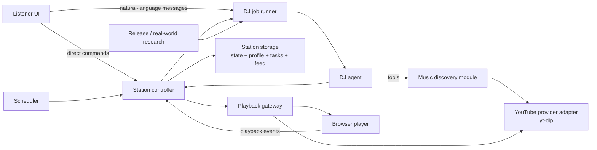

# Moodio architecture

**Status:** proposed v0.2 target architecture. This document describes the intended direction, not a claim that every module already exists.

## Design goal

Moodio is a personal, long-running DJ. It should keep a station coherent over time, learn from a listener's actions and instructions, and remain responsive when the listener takes direct control.

The product owns the decision and control system. Music stays with remote providers.

```text
Moodio owns: station state, queue, event history, listener profile,
             agent context, policies, and the browser playback control plane.

Providers own: music catalogues, media delivery, and provider-specific access.
```

This keeps the app personal without turning it into a private music repository or an audio downloader.

## Non-negotiable constraints

- Do not download, retain, or redistribute music tracks.
- Do not circumvent paywalls, DRM, login requirements, bot checks, or geographic restrictions. Treat tracks a provider cannot serve in the listener's context as unavailable.
- Do not expose provider cookies, credentials, or temporary media URLs to the agent or browser.
- A model may choose only from candidates returned by a provider interface.
- Human controls and agent tools mutate the same station state through the same control module.
- The agent is long-lived in memory, not an unbounded process: the runtime wakes it for bounded, observable runs.
- Explicit listener instructions outrank revisable taste notes.

## Terms

These terms are used consistently throughout this document.

- **Station**: one listener's persistent DJ experience: current playback, queue, listener profile, and active session.
- **Candidate**: provider metadata that is eligible for agent consideration but is not yet queued.
- **Track reference**: a stable `{provider, provider_track_id}` pair.
- **Program item**: a station-owned music or commentary item in the ordered Queue.
- **Music item**: a program item that refers to a resolved track.
- **Commentary item**: a program item containing DJ editorial content for a natural transition.
- **Direct response**: an immediate DJ answer that bypasses the Queue.
- **Playback handle**: an opaque, short-lived server-side reference used by the browser player. It is not a provider URL.
- **Station event**: an immutable, app-owned fact about a Station change or a meaningful player/scheduler observation. It is neither a conversation item nor raw tool telemetry.
- **Internal Station-event item**: a compact invisible rendering of a meaningful Station event retained in the Station session as application context. It is not a Listener message and never by itself starts a DJ run.
- **Station feed**: the Listener-facing ordered projection of relevant Station events and Direct responses.
- **Taste note**: a derived, editable plain-language conclusion about current taste.
- **Listener instruction**: an explicit listener rule, such as “no vocals while I work.”
- **Station controller**: the module that serializes state changes and emits station events.
- **Provider adapter**: a concrete implementation of the music-provider interface.

## System shape



The station controller is the central module. No caller—not the UI, agent, scheduler, or player—edits queue state directly.

## Modules and seams

### Station controller

**Interface:** accepts Station commands, returns a new Station snapshot, appends durable Station events, and publishes feed updates.

**Implementation responsibilities:**

- serialize queue and transport mutations
- enforce command idempotency and station revision checks
- give human commands precedence over stale agent work
- reject a stale DJ Queue command with structured `stale_queue_revision` data; permit one fresh append-only retry only when Queue health still requires it
- dispatch playback resolution after a track becomes current
- enqueue coalesced DJ jobs when station conditions require attention
- append relevant domain events to the persistent Station feed and publish their live updates

**Leverage:** every actor uses the same small interface, so a human skip and an agent skip have identical semantics and are equally visible to the next agent run.

### Music discovery module

**Interface:** turns a musical query and optional station context into normalized search results and queueable candidates.

It owns:

- provider searches and provider-specific ranking
- candidate normalization and deduplication
- availability checks
- short-lived metadata caching
- filtering of low-quality results such as covers, remixes, live recordings, or unrelated videos when the request calls for an original release

It does not own queue mutations or playback transport.

### Music-provider seam

Moodio depends on the following provider interface, not on yt-dlp command output or any provider payload directly.

```python
class MusicProvider(Protocol):
    key: str

    async def search_tracks(
        self,
    query: str,
    *,
    limit: int,
    context: DiscoveryContext,
) -> list[DiscoveryResult]: ...

    async def resolve_track(self, ref: TrackRef) -> ResolvedTrack: ...

    async def open_stream(self, track: ResolvedTrack) -> ProviderStream: ...

    async def health(self) -> ProviderHealth: ...
```

The first adapter to evaluate is the experimental `YouTubeProvider`. SoundCloud remains a deprecated legacy adapter until it can satisfy the same interface cleanly.

### Experimental YouTube provider adapter

`YouTubeProvider` uses a pinned yt-dlp binary as a short-lived resolver. For Music discovery it constructs a YouTube Music search URL, normalizes its provider-supported sections—songs, albums, artists, videos, and playlists—and tags each result with its kind.

```text
search(query)
  -> https://music.youtube.com/search?q=<query>
  -> yt-dlp --no-config --no-cache-dir --simulate --flat-playlist --dump-json
  -> mixed, normalized search results

resolve_track(video_id)
  -> refresh canonical metadata and availability

open_stream(video_id)
  -> yt-dlp obtains a temporary best-audio URL
  -> server opens the upstream stream
```

The direct-search UI is one Apple-Music-like fuzzy search box. It groups returned results with pills such as Songs, Artists, Albums, Videos, and Playlists; these are result labels, not a provider-specific search form. A Song or playable Video can become a Listener selection, with explicit **Play now** and **Queue next** controls. Both verify provider availability before committing. **Play now** then interrupts the current Music item, records it as skipped, and does not reinsert it; on failure it preserves current playback and reports the failure. **Queue next** only programs the verified selection without changing transport. Repeated Queue next choices append in click order to a Listener-priority segment immediately after the current item; the DJ cannot interpose music there, and any Anchored Commentary moves with the displaced target. An Artist, Album, or Playlist is a Browse result that opens further provider results before anything is queued. When the provider can reliably and quickly expand an artist or album, the UI may show that richer result; otherwise it falls back to a fuzzy follow-up search. Genre, mood, and activity are not a verified provider filter: the Listener or DJ expresses them as free-text queries, and the DJ may use bounded research to formulate or rank those queries. Discovery returns metadata only; playback remains a separate, just-in-time availability check.

The adapter must:

- run yt-dlp with timeouts, cancellation, and bounded output
- classify failures (`unavailable`, `login_required`, `bot_check`, `geo_blocked`, `extract_failed`)
- report authentication, bot-check, or regional restrictions as unavailable rather than trying to bypass them
- be updateable independently from the app
- never write full media tracks to disk

yt-dlp is an experimental implementation dependency, not a Moodio API. A later provider can replace it without changing the station controller or agent tools. A prototype must establish that it is reliable enough for this Listener before broader work depends on it.

#### Provider-spike gate

The spike tests a small representative set of direct searches: song, artist, album, genre, and mood. It records result quality, search and resolve latency, provider failure categories, and whether a selected candidate starts in the browser without saving audio. The gate is passed when ordinary searches can produce at least one real playable candidate reliably enough for personal use; Apple-Music-level catalogue navigation is not required.

### Playback gateway

**Interface:** given the current queue item, expose an app-owned playback URL to the browser and accept lifecycle reports from the browser.

```text
GET  /api/playback/{queue_item_id}
POST /api/events/playback
```

The gateway asks the provider adapter for a fresh upstream stream, proxies it, and preserves browser-required range behavior. It does not disclose temporary Google media URLs.

The browser owns its `<audio>` element and reports events such as buffering, started, paused, ended, near-end, and error. The server remains authoritative for what *should* be playing.

For direct Listener controls, the browser may optimistically render a pending action. Pause/resume also act on the local audio element immediately for responsiveness. Queue changes, skip, previous, and favorite show pending state but render the controller-confirmed snapshot as durable truth; on rejection or reconnect, the browser reconciles to that snapshot rather than maintaining a second Queue state machine. The Listener may drag/reorder or remove any upcoming Music item, whether Listener- or DJ-programmed; Anchored Commentary moves or is removed with its target, while unanchored Commentary is not independently draggable in v0.2. A removal is a meaningful event the DJ may later consider, and it may refill only if Queue health requires it. Previous restarts the current Music item when it has played for more than roughly five seconds; otherwise it attempts to replay the preceding completed Music item after a fresh provider resolution. If that item is unavailable, the Station reports it rather than substituting another track.

After a local server restart, persisted Queue/program state and the last known current item are retained, but playback is marked `recovering` until the browser reconnects and reports its actual player state. The server never resumes a provider stream merely because persisted state said it had been playing. A browser report that identifies a different track is an unreconciled recovery state, not evidence that the program changed: the controller does not infer or rewrite playback history and waits for an unambiguous player report or an explicit Listener action. While recovery is unresolved, the DJ may still perform safe append-only Queue programming after existing Listener choices, but may not resume, replace, or reorder playback.

### DJ job runner

The DJ does not run forever in one model call. The job runner creates bounded runs from durable triggers:

- listener sends natural language
- queue falls below its target
- player reports near-end or ended
- playback fails
- one low-priority editorial pulse per active hour
- scheduled research or taste-distillation run
- a due Station task created by the DJ

The runner coalesces equivalent work. For example, `queue_low`, `near_end`, and a cadence tick should normally create one `keep_station_healthy` job, not three concurrent agent turns. All Station runs use one serialized lane. A Listener message has priority over scheduled or operational work; background work that has not started is deferred or coalesced into a later useful run. A background run has a configurable ~20-second wall-clock budget, checked only between model and tool steps; when it expires, it ends cleanly and a later trigger can continue the work. Listener-requested runs use a looser budget. If a background run has already started, it finishes its current bounded step rather than being cancelled mid-mutation; direct Listener controls still execute immediately through the controller, and the Listener message runs next. A direct control's durable Station event is written immediately, while its Internal Station-event item is enqueued and flushed into the shared session at the next turn boundary so an in-flight run never receives a concurrent session mutation.

Queue health and recovery triggers are harness-owned operational guarantees. The editorial pulse is also harness-owned but deliberately quiet: it gives a new Station a predictable chance to refresh programming, consider a profile update, or make a useful task without requiring the DJ to have previously scheduled itself. An active listening window begins when playback starts and ends on an explicit Listener pause; its hourly pulse does not depend on the UI remaining open. The DJ may create, change, or cancel more specific Station tasks. While playback is paused, a background run may research, revise the profile, or safely append music for any relevant reason—such as queue health or a new release by an artist of clear Listener interest. It must not resume transport, reorder or replace Listener choices, or surface immediate/audible commentary.

### Station task scheduler

A Station task is a small persisted record: a plain-language instruction, its next run time or recurrence, and whether it remains active. The DJ manages it through `schedule_station_task`, `list_station_tasks`, `update_station_task`, and `cancel_station_task`.

When a task becomes due, the scheduler creates one bounded DJ job with that instruction as its trigger. v0.2 schedules only while the local Moodio service is running; on service startup it coalesces overdue tasks and operational triggers into one catch-up job rather than relying on an OS background daemon. Tasks do not run arbitrary code, receive extra permissions, or keep a model invocation alive. The Listener can inspect and remove them alongside the Listener profile.

### DJ agent

The DJ agent is one persistent personality with one Station session. Every bounded run—natural-language Listener interaction, queue-health work, or due Station task—continues that same compacted conversation, receives the compact profile and a small run header, and reads fresh operational state through focused tools.

The agent owns:

- editorial judgment
- natural-language interpretation
- candidate exploration and selection
- concise DJ speech
- suggesting concise, revisable taste notes from meaningful listening signals

The runtime owns:

- tool schemas and authorization
- queue correctness and concurrency
- candidate and provider validation
- scheduling and retry policy
- storage and event publication

Start with one agent and deep tools. Add specialist agents only if a real seam appears, such as a separate release-research workflow with its own evaluation and budget.

### Listener profile module

This module keeps durable personalization deliberately small and legible.

It owns:

- the Listener's explicit instructions
- a few revisable plain-language taste notes
- a compact profile supplied to the DJ as context
- an inspectable revision history with correction, reset, deletion, and diff support

The initial profile may be one editable Markdown document or a small JSON object with sections such as `instructions`, `taste_notes`, and `recent_signals`. It is not a preference graph, scoring system, or strict taxonomy. The runtime owns its location and audit trail; the DJ receives scoped read/update tools, never a generic filesystem tool. A profile update applies automatically and produces an inspectable revision; it does not require approval or a notification. Automatic updates retain a one-sentence reason in revision/event metadata, so the editable profile stays uncluttered while the UI can show the reason beside its diff. The runtime may preserve useful recent activity separately, but should only promote it into the profile when a simple explanation would make sense to the Listener.

### Research module

This module catches up on relevant real-world music context, initially through bounded web or feed research.

It can:

- revisit artists or release interests recorded in the Listener profile or a due Station task
- enrich a request with current context
- create a research observation that the DJ may use on an editorial check-in

It cannot queue arbitrary external content. A release notice must still flow through `search_tracks` and normal candidate selection.

## Core contracts

### Track candidate

```json
{
  "candidate_id": "youtube:video:abc123",
  "provider": "youtube",
  "provider_track_id": "abc123",
  "title": "Example Track",
  "artist": "Example Artist",
  "album": null,
  "duration_seconds": 248,
  "artwork_url": "https://...",
  "external_url": "https://www.youtube.com/watch?v=abc123",
  "availability": "unknown",
  "match_reasons": ["title", "artist", "original_release"],
  "warnings": []
}
```

Candidates are the only tracks the DJ or Listener may pass to a queue or play command. The Listener may search provider candidates and make a direct Listener selection without DJ approval. Candidate IDs may expire; the provider resolves a stable track reference again at playback time.

### Program item

```json
{
  "program_item_id": "pi_01...",
  "kind": "music",
  "track": {"provider": "youtube", "provider_track_id": "abc123"},
  "title": "Example Track",
  "artist": "Example Artist",
  "duration_seconds": 248,
  "requested_by": {"kind": "human", "id": "local-listener"},
  "reason": "Keeps the warmer electronic thread going.",
  "status": "queued",
  "station_revision": 42
}
```

For commentary, the same small envelope contains `kind: "commentary"` and `text`. It has no provider track. It may optionally name `for_music_item_id`, anchoring the line as a lead-in to one upcoming Music item; removing or moving that Music item removes or moves its anchored commentary with it. Unanchored Commentary remains valid for general transitions, but the controller never leaves commentary at the Queue tail without a following Music item. Commentary is an editorial option, not a cadence: the DJ uses it only when it genuinely improves a transition or explains a programming move, and treats silence as normal. The Queue stores the DJ's ordered program; the Listener's UI setting decides whether a Commentary item is also rendered as speech, and the delivery layer releases it only after a normal track completion and before the next Music item. A manual skip, pause/resume, playback failure, or other direct/recovery transport intervention suppresses waiting Commentary—including Anchored Commentary when the Listener skips directly to its target—because either the Listener has chosen the pacing or recovery must get music moving again. When Voice mode is off, the delivery layer displays the text as a brief program/feed card, consumes the item, and continues to the next Music item without delaying playback.

Music items store useful metadata for display and memory, but playback resolution always revalidates the provider track.

### Station command

Every mutation has an origin, an idempotency key, and an optional expected revision. Direct controls take this deterministic path immediately; they never wait for model reasoning.

```json
{
  "command_id": "cmd_01...",
  "origin": "human",
  "type": "queue.add",
  "expected_revision": 42,
  "payload": {"candidate_id": "youtube:video:abc123"}
}
```

Core command types:

```text
queue.add        queue.remove       queue.move
play_now         transport.play     transport.pause
transport.skip   transport.previous favorite.set
instruction.set  instruction.remove profile.note
```

The controller rejects or refreshes stale agent commands. Human direct controls are never delayed behind agent reasoning.

### Station event

Events are append-only domain facts. They drive the UI, fresh agent context, retries, and future profile updates. A meaningful direct Listener action is additionally queued for rendering into the Station session as a compact, hidden `developer`-role Internal Station-event item at the next safe session boundary. It is clearly marked as application context, not a Listener request, and does not invoke a DJ run or demand acknowledgement. The event feed remains authoritative; session items are a model-facing projection that may later be compacted. Raw agent-tool telemetry and cosmetic controls such as volume/seek are never rendered as these items.

The `developer` role is an initial projection choice, not a claim that it is behaviorally neutral. A later harness experiment must compare it with a hidden `user`-role item explicitly labelled as a non-conversational Listener action. The comparison should measure correct use of the action, unwanted acknowledgements, tool choices, and any model/provider-specific instruction bias. Both projections share the same durable Station event and feed record.

```json
{
  "event_id": "evt_01...",
  "station_id": "default",
  "sequence": 118,
  "kind": "playback.skipped",
  "origin": "human",
  "occurred_at": "2026-07-25T20:15:00Z",
  "payload": {"queue_item_id": "qi_01...", "position_seconds": 8}
}
```

Important event families:

```text
listener.command.*       queue.*
playback.*               provider.*
profile.*                instruction.*
task.*                   research.*
scheduler.*              dj.response.*
```

The event carries `origin` (`listener`, `dj`, `player`, or `scheduler`) and a correlation/run ID where applicable. By default, the UI exposes a broad, legible Station activity stream: meaningful Listener controls, DJ programming outcomes, profile/task changes, provider/recovery outcomes, and transient status lines. It never exposes raw tool calls, arguments, results, hidden session items, or chain-of-thought. A later UI preference may hide categories without changing storage or agent context. Meaningful Listener controls are durable, quiet activity cards rather than chat bubbles; cosmetic controls are omitted. A Listener message creates both a genuine conversation turn and a related feed entry. A meaningful direct control creates a command, event, and Internal Station-event item; a cosmetic direct control creates only the necessary state change/event.

### Listener profile

The durable profile is intentionally plain language. A first version can look like this, whether stored as Markdown or simple JSON:

```text
Instructions
- During work hours, keep talking sparse and avoid explicit lyrics.

Working taste notes
- Recently enjoying dream pop and warm electronic music.
- Usually skips long live recordings unless specifically requested.

Recent signals
- Queued an album by ...
```

Instructions are intentional policy, not weak recommendation signals. Taste notes are neither permanent facts nor a numerical model: the Listener can inspect, edit, or remove them, and the DJ treats them as helpful context rather than absolute rules.

## Agent tool surface

The public tool interface should be small and semantic:

```text
get_playback_state()
get_recent_events(limit)
get_queue()
read_listener_profile()
update_listener_profile(content, reason)
search_music(query, limit)
inspect_candidates(candidate_ids)
queue_music(candidate_id, reason, based_on_queue_revision)
queue_commentary(text, reason, based_on_queue_revision, for_music_item_id?)
play_now(candidate_id, reason)
remove_from_queue(queue_item_id)
pause() / resume() / skip()
favorite_current_track()
web_search(query, limit)
schedule_station_task(instruction, run_at_or_recurrence)
list_station_tasks()
update_station_task(task_id, instruction_or_recurrence)
cancel_station_task(task_id)
```

`get_queue()` returns the Queue revision, playback state and current item, plus ordered upcoming Program items with their type, origin (`listener` or `dj`), and any anchor relationship. It deliberately omits provider URLs and raw event history. `queue_music` and `queue_commentary` require that revision, reject stale or immediately duplicate work, and say in their tool descriptions that the DJ must inspect the Queue before programming it. `queue_commentary` accepts an optional `for_music_item_id`: omitted creates a general transition only when Music follows, while a supplied upcoming Music-item ID creates Anchored Commentary that moves or is removed with that item. A stale command returns structured `stale_queue_revision` data; the DJ may refresh and make one new append-only attempt only if Queue health remains below target, otherwise the job is superseded. The DJ can call `get_queue()` and `search_music()` in parallel before deciding what to queue. `play_now` is available only during an active Listener interaction that explicitly requests immediate playback; autonomous runs queue rather than interrupt.

The agent should not receive raw yt-dlp arguments, temporary URLs, database access, or a generic shell tool.

The final DJ output during an active Listener interaction is the Direct response and does not enter the Queue. `queue_music` and `queue_commentary` create ordered Program items. The DJ writes text; the Listener's UI-controlled Voice mode decides whether it is also rendered as speech. A voice-rendered direct response may briefly duck and resume music only for an active Listener interaction; autonomous DJ work must create a Commentary item instead. A background run's final output is internal status, not Listener-facing content.

Prompt guidance should cover behavior such as taste, tone, queue planning, and when to speak. The following remain harness rules because they require deterministic correctness:

- candidate-ID-only queueing
- provider and playback validation
- command authorization and revision checks
- human-over-agent precedence
- idempotency and queue invariants
- profile and Station-task scope
- bounded-run and output-channel boundaries
- secrets and temporary URL isolation

## State model

### Station state

```text
idle -> resolving -> buffering -> playing <-> paused
                          |             |
                          v             v
                       recovering <--- ended
                          |
                          v
                        failed
```

`thinking` and `speaking` are overlay activity states. The station can be playing music while the agent thinks, and music may duck while the DJ speaks.

### Queue item state

```text
candidate -> queued -> resolving -> ready -> current -> played
                         |                     |
                         v                     v
                      unavailable            failed
```

The current item is not considered playable until the provider has resolved it close to playback time.

### DJ job state

```text
pending -> running -> completed
                  |       |
                  v       v
              retryable  superseded
```

A human command can supersede an agent job if its plan was based on an old station revision. This is optimistic concurrency control: the DJ plans without holding a Station lock, then submits a revision-checked conditional command.

## Autonomy and session model

Moodio uses one persistent Agents SDK session per Station for conversational continuity, but every agent invocation is bounded. The session is a small file-backed implementation of the Agents SDK session interface, wrapped in `OpenAIResponsesCompactionSession`.

Compaction uses a configured inexpensive model and triggers only above a generous history threshold. This keeps the one-DJ conversation coherent across scheduled work without making normal short runs pay a compaction cost. The job runner serializes Station runs so two jobs cannot concurrently append to or compact the same session; a Listener message takes priority and background work is deferred or coalesced before it starts.

Compaction summarizes conversation history; it does not replace durable Station state. The Listener profile, Station tasks, Queue, and event history remain the durable application context. Each run receives only the compact profile and a tiny run header automatically; it reads live operational detail through scoped tools.

Natural-language Listener input is appended as a `user` conversation item. A direct control remains a typed controller command; after a meaningful control succeeds, the controller queues a compact Internal Station-event item for the Station session with a `developer` role and flushes it at the next safe boundary. A player report, scheduler tick, or due Station task remains a typed trigger. The role is an intentionally replaceable projection seam: an experiment may instead append a `user`-role item that clearly says it is a non-conversational Listener action.

At the start of every run, the dynamic system instructions contain only:

1. stable DJ policy and persona
2. active Listener instructions and concise Taste notes
3. a tiny run header: mode, trigger, response policy, and Station revision

The DJ pulls live operational detail with focused tools. `get_queue()` is the normal precondition for queued programming; it records the DJ's actual Queue observation in session history. Other scoped tools serve playback, events, tasks, or profile detail when needed. This avoids repeatedly stuffing a live Station snapshot into every model call while retaining a useful chronological series of internal event and tool observations.

For example, a Listener pause is immediately applied and recorded in the feed; its Internal Station-event item is written to the Station session at the next safe turn boundary, without producing a DJ response. A later DJ run can see the pause in history or inspect fresh state. A Listener message such as “make it warmer” is a real conversation turn and may result in queue commands and feed events. This keeps direct controls deterministic and prevents the session from becoming the system of record.

This makes the station robust across process restarts and prevents old chat history from becoming the only source of truth.

## Personalization lifecycle

### Capture

Automatically record high-signal actions:

- direct search and explicit queue
- favorite and unfavorite
- replay
- completed listen
- early skip, including position
- pause/resume and time-of-day context
- direct statements about taste

### Infer

The DJ may summarize meaningful recent activity into a candidate taste note during any relevant bounded run when it can state a short, plain-language reason. It should weigh explicit actions more heavily than passive behavior, but a single favorite, removal, or other isolated action is evidence rather than an automatic durable conclusion. Keep notes short and explainable. A low-frequency taste-reflection task is useful for revisiting longer patterns, but is not the only time a profile may change.

### Apply

The context builder supplies the compact Listener profile to the DJ. The DJ treats taste notes as helpful context, not as absolute rules, unless the profile contains an explicit instruction.

An explicit Listener instruction is written immediately when the Listener expresses it. The UI shows every profile revision as inspectable activity, but does not require advance approval or make the DJ announce the update.

### Correct

The Listener can inspect, remove, or override a taste note. “Never play this artist” becomes an instruction; “I have been enjoying this lately” remains a revisable taste note.

## Real-world awareness

Release awareness is a bounded research capability, not open-ended browsing.

Initial policy:

- research only artists with clear Listener-profile interest, meaningful favorites/listening activity, or a current user request
- run no more often than a scheduled cadence
- record what source and time produced the observation
- treat a release as ordinary DJ programming: append a playable candidate only when it fits the Listener and current Queue, never interrupt or notify merely because it is new; otherwise keep a quiet observation or do nothing
- show a release activity card only when research changes the Queue or Listener profile; no-op research remains internal
- resolve any resulting music through the normal provider path

The DJ may record a simple profile note or Station task when an artist merits recurring attention; v0.2 has no separate followed-artist model. This avoids turning the station into a news bot while still letting it feel current.

## Persistence

v0.2 uses an intentionally small app-owned file store, not SQLite. There is one `StationStorage` module; callers do not write these files directly:

```text
station.json          current playback, Queue, revision, and small operational state
listener-profile.md   editable instructions, taste notes, and recent signals
station-tasks.json    active DJ-managed Station tasks
agent-session.json    compacted conversation, tool, and Internal Station-event items
station-feed.jsonl    append-only durable Station feed
```

JSON snapshots are written to a temporary sibling and atomically replaced. Feed events are appended as one JSON object per line with a monotonic sequence; startup recovers a valid prefix if the final write was interrupted. This is sufficient for one local Station, low write volume, and no concurrent writers. SQLite remains a future migration option if those constraints stop holding.

The Listener profile is a small, editable working document, not a derived database model that must be perfectly rebuilt. The Station feed is the UI/activity history; the session is only compacted agent memory.

## Delivery surfaces

### Browser console

The browser is a station console, not a generic chat UI. It displays:

- now playing and provider status
- queue and direct transport controls
- a concise DJ feed and transcript
- quiet Listener-activity cards for meaningful direct controls
- broad, human-readable DJ/provider/recovery activity, with raw tool activity kept internal
- why a track was chosen when requested
- visible agent activity without exposing chain-of-thought
- editable listener profile
- a quiet profile-change item that opens the latest revision or diff

### HTTP and SSE surface

Suggested public local endpoints:

```text
GET  /api/station
GET  /api/events?after=<sequence>
POST /api/commands
GET  /api/playback/{queue_item_id}
POST /api/events/playback
GET  /api/listener-profile
PUT  /api/listener-profile
GET  /api/feed?after=<sequence>
GET  /api/stream              # Server-Sent Events
```

Commands and paginated history use ordinary HTTP. One server-to-client SSE stream carries live, domain-shaped Station-feed updates, playback state, and bounded run progress. On reconnect, the UI reloads persisted feed entries after its last sequence. Polling is only a recovery fallback.

### Why not ChatKit

ChatKit is a capable chat/thread surface, but Moodio's primary object is a Station, not a chat thread. Its player must remain independently controllable, direct controls must not be blocked behind a streamed model response, and autonomous Station activity must exist even without a Listener message. Using ChatKit would still leave us owning the controller, Station feed, persistence, and scheduler while adapting them into a second thread/item model. v0.2 therefore keeps a custom station UI and borrows only the useful patterns: durable finished items, transient progress, typed actions, and SSE.

## Failure handling

- If a candidate cannot resolve, mark it unavailable, emit a provider event, and choose another candidate.
- If yt-dlp fails transiently, retry within a bounded policy; do not hold the queue hostage.
- If every provider candidate fails, keep the station state honest and ask the DJ for a recovery move rather than pretending playback started.
- If the agent fails or times out, direct player controls remain usable and a deterministic queue-health job can retry later.
- If a provider requires unsupported authentication, surface that as configuration state, never as an opaque browser failure.

## Migration sequence

1. **Provider spike:** add `YouTubeProvider`, candidate search, resolve, stream proxy, and a real browser playback test. Keep SoundCloud behind a legacy flag.
2. **Shared controller:** route UI and agent mutations through commands, revisions, and persisted events.
3. **Program queue:** allow the shared Queue to hold music and commentary, while keeping direct responses outside it.
4. **Autonomous jobs:** replace provider-specific cadence loops with deduplicated queue-health/recovery work, one active-hour editorial pulse, and DJ-managed Station tasks.
5. **Listener profile:** persist an editable profile and the small amount of activity needed to keep its taste notes useful.
6. **Research:** add artist-release awareness only after profile and provider paths are reliable.

## Explicit non-goals for this phase

- downloading or building a private music archive
- reproducing a streaming provider's catalog API
- multi-user social radio
- fully autonomous open-web behavior
- self-modifying agent prompts or tools without evaluations and review
- multi-agent choreography before one DJ agent and its tools are demonstrably insufficient
